# Components

## Buttons

### Purpose
Buttons are interactive elements used to trigger actions, submit forms, navigate, or confirm user decisions. They provide clear call-to-action points throughout the interface.

### Variants
*What this means: Buttons come in 5 different styles and 3 sizes. The Primary button (teal/green color) is your main "click me" button. Secondary (dark gray) is for less important actions. Danger (red) warns users about destructive actions like deleting. Outline buttons have no background, just a border. Ghost buttons are the most subtle. You can also make buttons small, medium, or large.*

- **Primary**: Main action buttons with Gulf Stream background (#80b3b4), used for primary CTAs
- **Secondary**: Secondary actions with River Bed background (#454f59), used for less prominent actions
- **Danger**: Destructive actions with red/warning colors, used for delete or cancel operations
- **Outline**: Transparent background with border, used for secondary actions
- **Ghost**: Minimal styling, used for tertiary actions
- **Sizes**: 
  - `sm` (small): Padding `sm` (8px) horizontal and vertical
  - `md` (medium/default): Padding `sm` (8px) horizontal and vertical
  - `lg` (large): Padding `sm` (8px) horizontal and vertical

### Props
*What this means: When you use a Button, you can tell it what text to show (children), which style to use (variant), how big it should be (size), what happens when clicked (onClick), whether it's disabled, and if it should fill the full width. The type prop controls if it's a regular button, submits a form, or resets a form.*

```typescript
{
  children: React.ReactNode;        // Button text or content
  variant?: 'primary' | 'secondary' | 'danger' | 'outline' | 'ghost';
  size?: 'sm' | 'md' | 'lg';
  onClick?: () => void;             // Click handler
  disabled?: boolean;               // Disabled state
  type?: 'button' | 'submit' | 'reset';
  className?: string;               // Additional CSS classes
  fullWidth?: boolean;              // Full width button
}
```

### Usage Example
*What this means: Here's how you actually write Button code. The first example creates a teal "Register Now" button that runs handleSubmit when clicked. The second makes a large dark gray button. The third is a red delete button. The last one shows a disabled button that users can't click (useful when something is processing).*

```jsx
import Button from '@/components/Button';

// Primary button
<Button variant="primary" onClick={handleSubmit}>
  Register Now
</Button>

// Secondary button
<Button variant="secondary" size="lg">
  Learn More
</Button>

// Danger button
<Button variant="danger" onClick={handleDelete}>
  Delete Account
</Button>

// Disabled state
<Button variant="primary" disabled>
  Processing...
</Button>
```

### Visual Preview
*What this means: When you use a Primary button, it appears as a teal/green box with white text. Secondary buttons are dark gray with white text. All buttons have rounded corners and get slightly brighter when you hover over them. Disabled buttons look grayed out and don't respond to clicks. All buttons use consistent padding following the design system spacing scale: all button sizes use `sm` (8px) for both horizontal and vertical padding.*

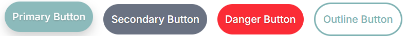

Primary buttons use the Gulf Stream color (#80b3b4) with white text. Secondary buttons use River Bed (#454f59) with white text. Buttons have rounded corners, hover effects, and proper spacing following the design system spacing tokens. All buttons use `sm` (8px) spacing token for both horizontal and vertical padding, ensuring consistent spacing across all button variants and sizes.

Disabled buttons are grayed out and non-interactive.

**Layout and Spacing Details:**
- **Padding**: All button sizes use `sm` (8px) for both horizontal and vertical padding
- **Border Radius**: `rounded-lg` (0.5rem / 8px) for consistent rounded corners
- **Hover Effects**: Background color lightens on hover (e.g., Gulf Stream #80b3b4 → #6fa0a1)
- **Outline Variant**: 2px solid border using River Bed color, transparent background
- **Ghost Variant**: No border, transparent background, hover shows Geyser background
- **Gap Between Buttons**: `gap-4` (16px) when buttons are grouped
- **Font Weight**: `font-medium` (500) for button text
- **Transition**: `transition-colors` for smooth hover effects

## Forms

### Purpose
Forms collect user input and data through various input fields, checkboxes, radio buttons, and other form controls. They enable user registration, data entry, search, and configuration.

### Variants
*What this means: Forms have many different input types. Text Input is for names, addresses, etc. Email Input checks if the email format is correct. Password hides what you type. Textarea lets users write longer text. Select/Dropdown shows a list to choose from. Checkbox is for yes/no options. Radio buttons let users pick one option from a group. File Upload lets users upload files. Search has a magnifying glass icon. Each input can show if it's normal, has an error (red border), succeeded (green border), or is disabled.*

- **Text Input**: Standard text input fields
- **Email Input**: Email validation built-in
- **Password Input**: Masked input for passwords
- **Textarea**: Multi-line text input
- **Select/Dropdown**: Single or multi-select dropdowns
- **Checkbox**: Single or grouped checkboxes
- **Radio**: Radio button groups
- **File Upload**: File input with preview
- **Search**: Search input with icon
- **Validation States**: Default, error, success, disabled

### Props
*What this means: For Input components, you must provide a name (like "email" or "password"), the current value, and an onChange function that updates when the user types. You can add a label above the input, a placeholder hint, mark it as required, show an error message, or disable it. The Form component wraps all inputs and handles submitting the whole form at once.*
```typescript
// Input component
{
  type?: 'text' | 'email' | 'password' | 'tel' | 'number';
  name: string;                     // Form field name
  value: string;                    // Controlled value
  onChange: (e: ChangeEvent) => void;
  placeholder?: string;
  label?: string;                   // Field label
  error?: string;                   // Error message
  required?: boolean;
  disabled?: boolean;
  className?: string;
}

// Form component
{
  onSubmit: (data: FormData) => void;
  children: React.ReactNode;
  className?: string;
}
```

### Usage Example
*What this means: This code creates a login form with two inputs. The email input shows "Email Address" as a label, checks if the email is valid, and displays an error message if there's a problem. The password input hides the text as the user types. Both are marked as required, so users must fill them in. When submitted, the handleSubmit function runs with all the form data.*

```jsx
import { Input, Form } from '@/components/Form';

<Form onSubmit={handleSubmit}>
  <Input
    type="email"
    name="email"
    label="Email Address"
    value={email}
    onChange={(e) => setEmail(e.target.value)}
    required
    error={errors.email}
  />
  
  <Input
    type="password"
    name="password"
    label="Password"
    value={password}
    onChange={(e) => setPassword(e.target.value)}
    required
  />
  
  <Button type="submit" variant="primary">
    Sign In
  </Button>
</Form>
```

### Visual Preview
*What this means: Form inputs appear as white boxes with light gray borders. Each input has a label above it. When there's an error, the border turns red and a red error message appears below. When the input is valid, the border turns green. All inputs have consistent spacing so forms look organized and easy to read.*

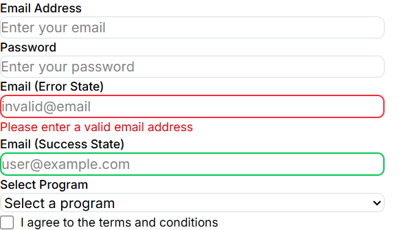

Form inputs have consistent spacing, clear labels, and error states with red borders and error messages below. Success states show green borders. Inputs use the Geyser color (#d5e0e1) for borders and River Bed (#454f59) for text.

**Layout and Spacing Details:**
- **Input Padding**: `px-4 py-2` (16px horizontal, 8px vertical) for comfortable text input
- **Label Spacing**: `mb-1` (4px) between label and input field
- **Border**: 1px solid using Geyser color (#d5e0e1) for default state
- **Border Radius**: `rounded-lg` (0.5rem / 8px)
- **Focus State**: 2px box shadow using Gulf Stream color (#80b3b4) on focus
- **Error State**: 2px solid red border (`border-red-500`)
- **Success State**: 2px solid green border (`border-green-500`)
- **Error Message**: `mt-1` (4px) spacing above error text, red text color
- **Form Field Spacing**: `space-y-4` (16px) between form fields
- **Checkbox/Radio Spacing**: `gap-2` (8px) between checkbox/radio and label
- **Select Dropdown**: Same padding and styling as text inputs

## Cards

### Purpose
Cards are container components that group related content and actions together. They provide visual separation and organization for content blocks, making information easier to scan and interact with.

### Variants
*What this means: Cards come in different styles. Default cards have a subtle shadow that makes them look like they're floating. Elevated cards have a stronger shadow to really stand out. Outlined cards use a border instead of shadow for a cleaner look. Image Cards have a picture at the top. Action Cards have buttons or links at the bottom. Interactive cards change slightly when you hover over them (useful for clickable cards).*

- **Default**: Standard card with shadow and rounded corners
- **Elevated**: Higher shadow for emphasis
- **Outlined**: Border instead of shadow
- **Image Card**: Card with header image
- **Action Card**: Card with footer actions
- **Interactive**: Hover effects for clickable cards

### Props
*What this means: You can give a Card a title and description at the top. You can add an image that appears at the top of the card. The children prop is where you put the main content of the card. The footer is where you put buttons or links. If you provide an onClick function, the whole card becomes clickable. You can choose which style variant to use.*

```typescript
{
  title?: string;                   // Card title
  description?: string;             // Card description
  image?: string;                   // Optional header image URL
  imageAlt?: string;               // Image alt text
  children: React.ReactNode;        // Card content
  footer?: React.ReactNode;         // Footer content (buttons, links)
  onClick?: () => void;            // Click handler for interactive cards
  className?: string;
  variant?: 'default' | 'elevated' | 'outlined';
}
```

### Usage Example
*What this means: The first example creates a simple card with a title, description, and extra content inside. The second example adds an image at the top and a "Register" button at the bottom. The third example makes the whole card clickable - when users click anywhere on it, they navigate to a program details page. The elevated variant makes it stand out more.*

```jsx
import Card from '@/components/Card';

// Basic card
<Card title="Event Title" description="Event description here">
  <p>Additional content goes here</p>
</Card>

// Card with image
<Card
  title="Summer Tournament"
  description="Join us for the annual summer tournament"
  image="/images/tournament.jpg"
  footer={
    <Button variant="primary">Register</Button>
  }
/>

// Interactive card
<Card
  title="Program Details"
  onClick={() => navigate('/programs/1')}
  variant="elevated"
>
  Click to view details
</Card>
```

### Visual Preview
*What this means: Cards look like white boxes with rounded corners sitting on the page. They have a subtle shadow that makes them look like they're floating above the background. Image cards show the picture at the top, then the title and content below. When you hover over an interactive card, it slightly lifts up (shadow gets bigger) to show it's clickable. All cards have consistent padding so content doesn't touch the edges.*


Cards have rounded corners, subtle shadows (or borders for outlined variant), consistent padding, and clear visual hierarchy. Image cards show the image at the top with content below. Interactive cards have hover effects that slightly elevate the card.

**Layout and Spacing Details:**
- **Card Padding**: `sm` (8px) spacing token for internal padding on all sides
- **Border Radius**: `rounded-lg` (0.5rem / 8px)
- **Default Shadow**: `shadow-md` for subtle elevation
- **Elevated Shadow**: `shadow-xl` for stronger emphasis
- **Outlined Variant**: 2px solid border using River Bed color (#454f59), no shadow
- **Default Variant**: 1px solid border using Geyser color (#d5e0e1) with shadow
- **Title Spacing**: `mb-2` (8px) below card title
- **Content Spacing**: `mb-4` (16px) below description/content
- **Grid Layout**: `gap-6` (24px) between cards in grid layouts
- **Image Card**: Image at top (h-48 / 192px), content area below with same padding
- **Hover Effects**: Shadow increases on interactive cards

## Navigation

### Purpose
Navigation components help users move through the application, understand their current location, and access different sections or pages. They include menus, nav bars, sidebars, and navigation links.

### Variants
*What this means: Navigation comes in different forms. The Navbar is the horizontal bar at the top of every page with links like Home, Programs, Events. The Sidebar is a vertical menu on the side (common in admin panels). The Mobile Menu is the hamburger icon (three lines) that opens a menu on phones. Breadcrumbs show where you are (Home > Programs > Basketball). Pagination lets you go through pages of results. Tabs let you switch between different sections on the same page.*

- **Navbar**: Horizontal top navigation bar
- **Sidebar**: Vertical side navigation
- **Mobile Menu**: Hamburger menu for mobile devices
- **Breadcrumbs**: Hierarchical navigation path
- **Pagination**: Page navigation for lists
- **Tabs**: Tabbed navigation within a page

### Props
*What this means: For the Navbar, you provide a logo (usually an image), an array of links with labels and URLs, and optionally a user menu (like a profile dropdown). Each link can be marked as active to highlight the current page. NavLink is for individual navigation links - you give it the path to navigate to and it handles the routing.*

```typescript
// Navbar component
{
  logo?: React.ReactNode;          // Logo component
  links: Array<{
    label: string;
    href: string;
    active?: boolean;
  }>;
  userMenu?: React.ReactNode;       // User menu dropdown
  className?: string;
}

// NavLink component
{
  to: string;                       // Route path
  children: React.ReactNode;
  active?: boolean;
  className?: string;
}
```

### Usage Example
*What this means: This code creates a navbar with the FGA logo on the left, four navigation links in the middle (Home, Programs, Events, About), and a user menu on the right. The NavLink example shows how to create a single link that highlights when the current page matches its path.*

```jsx
import Navbar, { NavLink } from '@/components/Navigation';

<Navbar
  logo={}
  links={[
    { label: 'Home', href: '/' },
    { label: 'Programs', href: '/programs' },
    { label: 'Events', href: '/events' },
    { label: 'About', href: '/about' }
  ]}
  userMenu={<UserIcon />}
/>

// Navigation links
<NavLink to="/programs" active={currentPath === '/programs'}>
  Programs
</NavLink>
```

### Visual Preview
*What this means: The navbar stays at the top of the page even when you scroll. The FGA logo (FGA-Logo.png) is on the left, links are in the center or right, and a user profile icon is on the far right. The link for the current page is highlighted in teal (Gulf Stream color) so users know where they are. The profile icon is a circular button with a user icon inside that changes color on hover. On mobile phones, the links hide and a hamburger icon (three horizontal lines) appears instead. Clicking it opens a menu that slides in from the side.*


The navbar is sticky at the top with the FGA logo (FGA-Logo.png) on the left, navigation links in the center/right, and a user profile icon on the far right. Active links are highlighted with Gulf Stream color. The profile icon is a circular button with a user icon that has a hover effect. The navbar uses `base` (16px) spacing token for internal padding, ensuring consistent spacing. Mobile view shows a hamburger icon that expands to a slide-in menu.

**Layout and Spacing Details:**
- **Navbar Padding**: `base` (16px) spacing token for internal padding on all sides
- **Logo Height**: 48px (auto width to maintain aspect ratio)
- **Logo File**: `/FGA-Logo.png` from public folder
- **Navigation Links**: `gap-6` (24px) between navigation links
- **Active Link**: Gulf Stream color (#80b3b4) with 2px solid bottom border
- **Inactive Links**: River Bed color (#454f59), hover changes to Gulf Stream
- **Profile Icon**: 
  - Circular button: `w-8 h-8` (32px × 32px)
  - Background: Geyser color (#d5e0e1), hover changes to Gulf Stream
  - Icon: 20px × 20px SVG user icon in River Bed color
- **Border**: 1px solid bottom border using Geyser color
- **Max Width**: `max-w-6xl` (1152px) with centered content
- **Layout**: Flexbox with `justify-between` for logo, links, and profile icon

## Modals & Dialogs

### Purpose
Modals and dialogs are overlay components that focus user attention on specific tasks or information. They require user interaction before returning to the main interface, making them ideal for confirmations, forms, or important messages.

### Variants
*What this means: Modals are popup windows that appear on top of the page. A full Modal covers most of the screen with a dark overlay behind it. A Dialog is smaller and more focused. Confirmation dialogs ask "Are you sure?" with Yes/No buttons. Form Modals contain a form inside. Info Modals just display information. You can choose how big they are - small for quick messages, large for complex content.*

- **Modal**: Full overlay with centered content
- **Dialog**: Smaller, focused dialog box
- **Confirmation**: Yes/No confirmation dialogs
- **Form Modal**: Modal containing a form
- **Info Modal**: Information display modal
- **Sizes**: `sm` (small), `md` (medium), `lg` (large), `xl` (extra large)

### Props
*What this means: You control whether the modal is visible with isOpen (true = show, false = hide). When users close it, onClose runs. You can add a title at the top, put content in the middle (children), and add buttons at the bottom (footer). You choose the size. You can decide if clicking the dark area behind the modal closes it, and if pressing the ESC key closes it.*

```typescript
{
  isOpen: boolean;                  // Control visibility
  onClose: () => void;             // Close handler
  title?: string;                  // Modal title
  children: React.ReactNode;       // Modal content
  footer?: React.ReactNode;        // Footer buttons
  size?: 'sm' | 'md' | 'lg' | 'xl';
  closeOnOverlayClick?: boolean;   // Close when clicking overlay
  closeOnEscape?: boolean;         // Close on ESC key
  className?: string;
}
```

### Usage Example
*What this means: This code creates a confirmation modal that asks "Are you sure?" when deleting something. The modal shows when isOpen is true. It has a title, a warning message, and two buttons at the bottom - Cancel (which closes the modal) and Delete (which actually deletes the item). The state variable controls whether the modal is visible.*

```jsx
import Modal from '@/components/Modal';

const [isOpen, setIsOpen] = useState(false);

<Modal
  isOpen={isOpen}
  onClose={() => setIsOpen(false)}
  title="Confirm Deletion"
  size="md"
>
  <p>Are you sure you want to delete this item? This action cannot be undone.</p>
  <Modal.Footer>
    <Button variant="secondary" onClick={() => setIsOpen(false)}>
      Cancel
    </Button>
    <Button variant="danger" onClick={handleDelete}>
      Delete
    </Button>
  </Modal.Footer>
</Modal>
```

### Visual Preview
*What this means: When a modal opens, the whole page gets darker behind it (like a shadow), and a white box appears in the center. The white box has rounded corners and a shadow. There's an X button in the top-right corner to close it. The modal content is centered on the screen. On mobile phones, the modal takes up most of the screen but still looks good.*

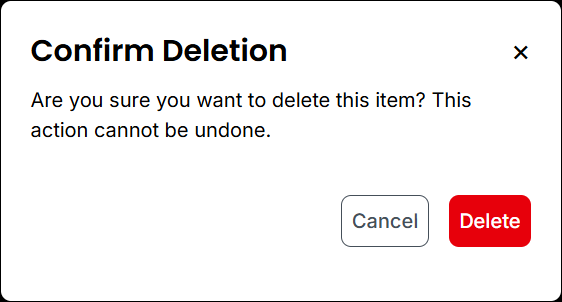

Modals appear as centered overlays with a semi-transparent dark background. The modal content has a white background, rounded corners, and shadow. It includes a close button (X) in the top-right corner. The modal uses `lg` (24px) spacing token for internal padding, ensuring consistent spacing. The modal is responsive and adapts to mobile screens.

**Layout and Spacing Details:**
- **Container**: Uses flexbox column layout (`flex flex-col`) with `lg` (24px) padding on all sides
- **Minimum Height**: 240px to ensure adequate content space
- **Header Section**: Title and close button with `mb-4` (16px) spacing below
- **Content/Paragraph**: 
  - `marginTop: 12px` (spacing from header)
  - `marginBottom: 24px` (spacing before buttons)
- **Button Container**: 
  - `marginTop: 16px` (additional spacing from content)
  - Buttons aligned to the right with `gap-4` (16px) between them
- **Overall Structure**: Header → Content → Buttons, with consistent spacing using design system tokens

## Alerts

### Purpose
Alerts communicate important information, system status, errors, warnings, or success messages to users. They provide feedback about actions and system states without blocking the user's workflow.

### Variants
*What this means: Alerts come in four colors based on their purpose. Success alerts are green and celebrate when something works (like "Registration successful!"). Error alerts are red and warn about problems (like "Invalid email address"). Warning alerts are yellow and caution users (like "Your session expires soon"). Info alerts are blue and provide helpful information (like "New events posted every Monday"). You can add a close button (X) to make alerts dismissible, and add icons to make them more visual.*

- **Success**: Green alert for successful actions
- **Error**: Red alert for errors and failures
- **Warning**: Yellow/amber alert for warnings
- **Info**: Blue alert for informational messages
- **Dismissible**: Alert with close button
- **With Icon**: Alert with contextual icon

### Props
*What this means: You must choose which type of alert it is (success, error, warning, or info) - this controls the color. You provide the message text. You can add a title above the message. If dismissible is true, an X button appears. When users click the X, onDismiss runs. You can add a custom icon (like a checkmark for success or an exclamation mark for errors).*

```typescript
{
  variant: 'success' | 'error' | 'warning' | 'info';
  title?: string;                  // Alert title
  message: string;                  // Alert message
  dismissible?: boolean;           // Show close button
  onDismiss?: () => void;         // Dismiss handler
  icon?: React.ReactNode;         // Custom icon
  className?: string;
}
```

### Usage Example
*What this means: The first example shows a green success alert with a title and message that users can close. The second shows a red error alert that also has a close button and runs handleDismiss when closed. The third is a simple blue info alert without a close button - it just displays information.*

```jsx
import Alert from '@/components/Alert';

// Success alert
<Alert variant="success" title="Success!" dismissible>
  Your registration was successful.
</Alert>

// Error alert
<Alert variant="error" title="Error" dismissible onDismiss={handleDismiss}>
  Please check your input and try again.
</Alert>

// Info alert
<Alert variant="info">
  New events are posted every Monday.
</Alert>
```

### Visual Preview
*What this means: Alerts appear as colored boxes. Success alerts are green with white text. Error alerts are red with white text. Warning alerts are yellow/amber. Info alerts are blue. They usually appear at the top of the content or inline where they're placed. If they have a close button, there's an X in the top-right corner. Icons appear on the left side when provided.*

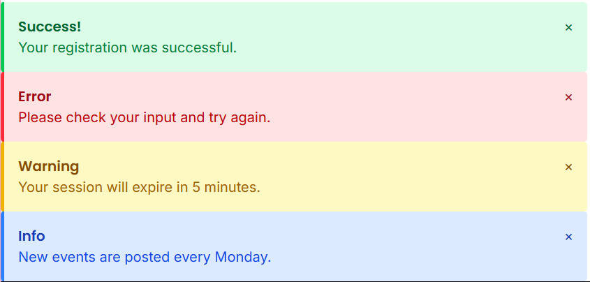

Alerts appear at the top of the content area or inline. Success alerts have a green background with white text, error alerts are red, warnings are yellow/amber, and info alerts are blue. Dismissible alerts show an X button in the top-right corner. Icons appear on the left side when provided.

**Layout and Spacing Details:**
- **Alert Padding**: `base` (16px) spacing token on all sides
- **Border**: 4px solid left border (`border-l-4`) using variant color
- **Border Radius**: `rounded` (0.25rem / 4px)
- **Title Spacing**: `mb-1` (4px) below alert title
- **Layout**: Flexbox with `justify-between` for content and close button
- **Close Button**: Positioned top-right, hover color change
- **Alert Spacing**: `space-y-4` (16px) between multiple alerts
- **Color Variants**:
  - Success: `bg-green-100`, `border-green-500`, `text-green-800` (title), `text-green-700` (message)
  - Error: `bg-red-100`, `border-red-500`, `text-red-800` (title), `text-red-700` (message)
  - Warning: `bg-yellow-100`, `border-yellow-500`, `text-yellow-800` (title), `text-yellow-700` (message)
  - Info: `bg-blue-100`, `border-blue-500`, `text-blue-800` (title), `text-blue-700` (message)

## Tables

### Purpose
Tables organize and display structured data in rows and columns, making it easy to compare, sort, and analyze information. They are essential for displaying datasets, lists, and tabular information.

### Variants
*What this means: Tables can look different. Default tables have basic borders. Striped tables alternate between white and light gray rows (like zebra stripes) to make it easier to read across rows. Bordered tables have borders around every cell. Hoverable tables highlight a row when you move your mouse over it. Sortable tables let you click column headers to sort the data (A-Z, Z-A). Responsive tables scroll sideways on phones. Compact tables have less padding to fit more data.*

- **Default**: Standard table with borders
- **Striped**: Alternating row colors for readability
- **Bordered**: All cells have borders
- **Hoverable**: Rows highlight on hover
- **Sortable**: Clickable column headers for sorting
- **Responsive**: Scrollable on mobile devices
- **Compact**: Reduced padding for dense data

### Props
*What this means: You provide an array of columns - each column has a key (like "name" or "email"), a label (what shows in the header), and optionally can be sortable. The render function lets you customize how a cell looks (like showing a badge instead of plain text). You provide the data as an array of objects. When a column is sorted, onSort runs. You can show a message when there's no data.*

```typescript
{
  columns: Array<{
    key: string;
    label: string;
    sortable?: boolean;
    render?: (value: any, row: any) => React.ReactNode;
  }>;
  data: Array<Record<string, any>>;
  onSort?: (column: string, direction: 'asc' | 'desc') => void;
  variant?: 'default' | 'striped' | 'bordered' | 'hoverable';
  className?: string;
  emptyMessage?: string;           // Message when no data
}
```

### Usage Example
*What this means: This code creates a table with three columns: Name (sortable), Email, and Status. The Status column uses a custom render function to show a Badge component instead of plain text. The data array contains two user records. The table uses striped styling and handles sorting when column headers are clicked. If there's no data, it shows "No data available".*

```jsx
import Table from '@/components/Table';

const columns = [
  { key: 'name', label: 'Name', sortable: true },
  { key: 'email', label: 'Email' },
  { key: 'status', label: 'Status', render: (value) => <Badge>{value}</Badge> }
];

const data = [
  { id: 1, name: 'John Doe', email: 'john@example.com', status: 'Active' },
  { id: 2, name: 'Jane Smith', email: 'jane@example.com', status: 'Pending' }
];

<Table
  columns={columns}
  data={data}
  variant="striped"
  onSort={handleSort}
  emptyMessage="No data available"
/>
```

### Visual Preview
*What this means: Tables have dark gray headers (River Bed color) with white text. Striped tables alternate white and light gray rows. When you hover over a row in a hoverable table, it gets a subtle teal tint. Sortable columns show up/down arrows in the header. On mobile phones, tables scroll sideways so you can see all columns.*

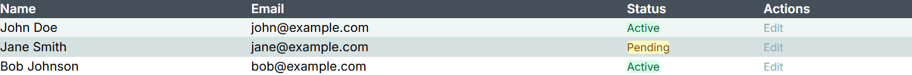

Tables have clear column headers with River Bed (#454f59) background. Striped tables alternate between white and Geyser (#d5e0e1) backgrounds. Hoverable rows highlight with a subtle Gulf Stream (#80b3b4) tint. Sortable columns show up/down arrows. Tables are responsive with horizontal scroll on mobile.

**Layout and Spacing Details:**
- **Header Cell Padding**: `px-6 py-3` (24px horizontal, 12px vertical)
- **Body Cell Padding**: `px-6 py-4` (24px horizontal, 16px vertical)
- **Header Background**: River Bed color (#454f59) with white text
- **Header Font**: `font-semibold` (600 weight)
- **Row Borders**: 1px solid bottom border using Geyser color (#d5e0e1)
- **Striped Rows**: Alternating white and Geyser (#d5e0e1) backgrounds
- **Hover Effect**: Background changes to `#f0f5f5` (light teal tint) on row hover
- **Text Colors**: River Bed (#454f59) for primary text, Oslo Gray (#7f858c) for secondary text
- **Badge Spacing**: `px-2 py-1` (8px horizontal, 4px vertical) for status badges
- **Action Buttons**: Gulf Stream color (#80b3b4), hover lightens to #6fa0a1
- **Table Container**: `overflow-x-auto` for horizontal scrolling on mobile

## Lists

### Purpose
Lists present collections of items in an organized, scannable format. They can be simple, ordered, unordered, or interactive, and are used for navigation menus, content listings, and data displays.

### Variants
*What this means: Lists can be unordered (bullet points) or ordered (numbered 1, 2, 3). Interactive lists have clickable items that do something when clicked. Divided lists have lines between items to separate them. Icon lists show an icon next to each item (like a checkmark or arrow). Nested lists are lists inside lists (like sub-items).*

- **Unordered**: Bullet point list
- **Ordered**: Numbered list
- **Interactive**: Clickable list items
- **Divided**: Items separated by dividers
- **Icon List**: List items with icons
- **Nested**: Lists within lists

### Props
*What this means: You provide an array of items. Each item has an id (unique identifier), content (what shows in the list), and optionally an icon, an onClick function (makes it clickable), and an active state (highlights the current item). You choose the variant style and whether it's ordered (numbered) or unordered (bullets).*

```typescript
{
  items: Array<{
    id: string | number;
    content: React.ReactNode;
    icon?: React.ReactNode;
    onClick?: () => void;
    active?: boolean;
  }>;
  variant?: 'default' | 'divided' | 'interactive';
  ordered?: boolean;
  className?: string;
}
```

### Usage Example
*What this means: The first example creates an interactive menu list where each item has an icon and navigates to a different page when clicked. The second example is a simple numbered list (1, 2, 3) showing features. Interactive lists are great for navigation menus, while ordered lists are good for step-by-step instructions.*

```jsx
import List from '@/components/List';

const menuItems = [
  { id: 1, content: 'Dashboard', icon: <HomeIcon />, onClick: () => navigate('/dashboard') },
  { id: 2, content: 'Events', icon: <CalendarIcon />, onClick: () => navigate('/events') },
  { id: 3, content: 'Programs', icon: <ProgramIcon />, onClick: () => navigate('/programs') }
];

<List
  items={menuItems}
  variant="interactive"
/>

// Simple list
<List
  items={[
    { id: 1, content: 'Feature 1' },
    { id: 2, content: 'Feature 2' },
    { id: 3, content: 'Feature 3' }
  ]}
  ordered
/>
```

### Visual Preview
*What this means: Lists have consistent spacing between items so they're easy to read. Interactive lists show a teal background when you hover over an item. Divided lists have subtle gray lines between items. Icon lists align icons on the left with text next to them. Active items (like the current page in a menu) are highlighted in teal (Gulf Stream color).*

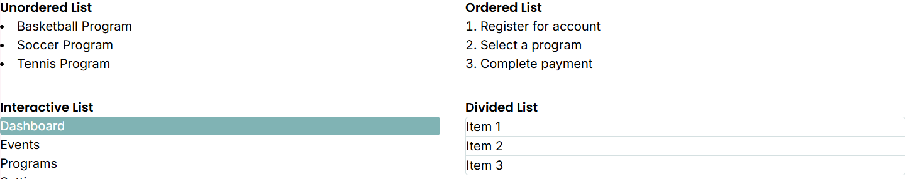

Lists have consistent spacing between items. Interactive lists show hover effects with Gulf Stream background. Divided lists have subtle borders between items. Icon lists align icons on the left with content. Active items are highlighted with the Gulf Stream color.

**Layout and Spacing Details:**
- **List Item Spacing**: `space-y-2` (8px) for unordered/ordered lists, `space-y-1` (4px) for interactive lists
- **Interactive Item Padding**: `px-4 py-2` (16px horizontal, 8px vertical)
- **Active Item**: Gulf Stream background (#80b3b4) with white text
- **Hover Effect**: Background changes to Geyser (#d5e0e1) on hover for inactive items
- **Divided List**: 
  - Container border: 1px solid Geyser color
  - Item borders: 1px solid bottom border using Geyser color (except last item)
  - Item padding: `px-4 py-3` (16px horizontal, 12px vertical)
- **Icon Alignment**: Icons aligned left with `gap-2` (8px) between icon and text
- **List Markers**: `list-disc list-inside` for unordered, `list-decimal list-inside` for ordered
- **Text Color**: Oslo Gray (#7f858c) for list text

## Icons

### Purpose
Icons are visual symbols that represent actions, objects, or concepts. They enhance usability by providing quick visual recognition, saving space, and improving the overall visual communication of the interface.

### Variants
*What this means: Icons come in five sizes from extra small (12px) to extra large (32px). They can be different colors: default dark gray, primary teal, secondary gray, or semantic colors (green for success, red for error, yellow for warning). Icons can be filled (solid), outlined (just the shape), or rounded (softer corners). You can add text labels next to icons, or make the icon itself clickable like a button.*

- **Sizes**: `xs` (12px), `sm` (16px), `md` (20px), `lg` (24px), `xl` (32px)
- **Colors**: Default (River Bed), Primary (Gulf Stream), Secondary (Oslo Gray), Success, Error, Warning
- **Styles**: Filled, Outlined, Rounded
- **With Label**: Icon with text label
- **Button Icon**: Icon as clickable button

### Props
*What this means: You provide the icon name (like "user" or "settings") from your icon library. You choose the size. You choose the color (either a preset like "primary" or a custom color string). If you provide onClick, the icon becomes clickable. The label is for accessibility (screen readers) and can also show as text next to the icon.*

```typescript
{
  name: string;                    // Icon name from icon library
  size?: 'xs' | 'sm' | 'md' | 'lg' | 'xl' | number;
  color?: 'default' | 'primary' | 'secondary' | 'success' | 'error' | 'warning' | string;
  className?: string;
  onClick?: () => void;            // For clickable icons
  label?: string;                  // Accessible label
}
```

### Usage Example
*What this means: The first example shows a basic user icon at medium size. The second shows a large green checkmark icon (success color). The third shows a settings icon with "Settings" text next to it. The fourth creates a clickable delete icon that's red and runs handleDelete when clicked.*

```jsx
import Icon from '@/components/Icon';

// Basic icon
<Icon name="user" size="md" />

// Colored icon
<Icon name="check-circle" size="lg" color="success" />

// Icon with label
<Icon name="settings" label="Settings" />

// Clickable icon button
<Icon
  name="trash"
  size="md"
  color="error"
  onClick={handleDelete}
  label="Delete"
/>
```

### Visual Preview
*What this means: Icons are consistently sized and colored. Primary icons use the teal color (Gulf Stream), default icons use dark gray (River Bed). Icons maintain proper spacing when used with text labels. Clickable icons show a hover effect (like getting slightly bigger or changing color) to indicate they're interactive.*

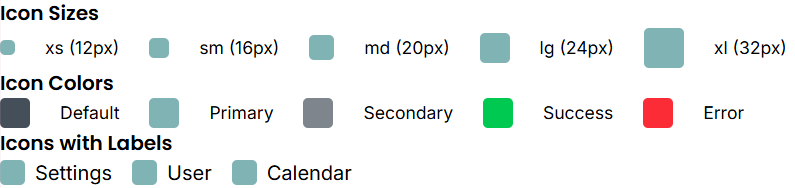

Icons are consistently sized and colored according to the design system. Primary icons use Gulf Stream (#80b3b4), default icons use River Bed (#454f59). Icons maintain proper spacing when used with text. Clickable icons show hover effects.

**Layout and Spacing Details:**
- **Icon Sizes**: 
  - `xs`: 12px (w-3 h-3)
  - `sm`: 16px (w-4 h-4)
  - `md`: 20px (w-5 h-5)
  - `lg`: 24px (w-6 h-6)
  - `xl`: 32px (w-8 h-8)
- **Icon Colors**:
  - Default: River Bed (#454f59)
  - Primary: Gulf Stream (#80b3b4)
  - Secondary: Oslo Gray (#7f858c)
  - Success: Green (#22c55e)
  - Error: Red (#ef4444)
- **Icon with Label**: `gap-2` (8px) between icon and text label
- **Icon Display**: `flex items-center` for proper alignment
- **Border Radius**: `rounded` for icon containers
- **Spacing Between Icons**: `gap-6` (24px) when displaying multiple icon sizes
- **Label Text**: Oslo Gray (#7f858c) for icon labels

## Tooltips & Popovers

### Purpose
Tooltips and popovers provide contextual information, help text, or additional details when users hover over or interact with elements. They offer supplementary information without cluttering the main interface.

### Variants
*What this means: Tooltips are small popups that appear when you hover over something - they're great for short hints. Popovers are bigger and can hold more content like forms or detailed information. You can position them on any side (top, bottom, left, right) or at corners (top-start, bottom-end, etc.). They can appear on hover, click, or when an element gets focus. Arrows point to the element that triggered them.*

- **Tooltip**: Small popup on hover
- **Popover**: Larger popup with more content
- **Placement**: `top`, `bottom`, `left`, `right`, `top-start`, `top-end`, etc.
- **Trigger**: `hover`, `click`, `focus`
- **With Arrow**: Tooltip with pointing arrow

### Props
*What this means: You wrap the element you want to show a tooltip for in the Tooltip component (that's the children). You provide the content that appears in the tooltip. You choose where it appears (placement) - like above, below, or to the side. You choose when it appears (trigger) - hover, click, or focus. You can show an arrow pointing to the element. You can add a delay so it doesn't appear instantly.*

```typescript
{
  content: React.ReactNode;         // Tooltip/popover content
  children: React.ReactNode;       // Element that triggers tooltip
  placement?: 'top' | 'bottom' | 'left' | 'right' | 'top-start' | 'top-end' | 'bottom-start' | 'bottom-end' | 'left-start' | 'left-end' | 'right-start' | 'right-end';
  trigger?: 'hover' | 'click' | 'focus';
  showArrow?: boolean;
  className?: string;
  delay?: number;                  // Delay before showing (ms)
}
```

### Usage Example
*What this means: The first example wraps an edit icon - when you hover over it, a small tooltip says "Click to edit" appears above it. The second example creates a popover with formatted content (heading and paragraph) that appears when you click a help icon. The third example adds a tooltip to a button that appears below when you hover.*

```jsx
import { Tooltip, Popover } from '@/components/Tooltip';

// Basic tooltip
<Tooltip content="Click to edit" placement="top">
  <Icon name="edit" />
</Tooltip>

// Popover with more content
<Popover
  content={
    <div>
      <h4>Help Information</h4>
      <p>This field is required for registration.</p>
    </div>
  }
  placement="right"
  trigger="click"
>
  <Icon name="help-circle" />
</Popover>

// Tooltip on button
<Tooltip content="Save your changes" placement="bottom">
  <Button variant="primary">Save</Button>
</Tooltip>
```

### Visual Preview
*What this means: Tooltips appear as small dark boxes (dark gray background) with white text, positioned near the element. They have rounded corners and a subtle shadow. Arrows point to the element that triggered them. Popovers are larger boxes that can contain formatted content like headings and paragraphs. They appear based on the trigger - hover shows them immediately, click shows them until you click elsewhere, focus shows them when you tab to the element.*

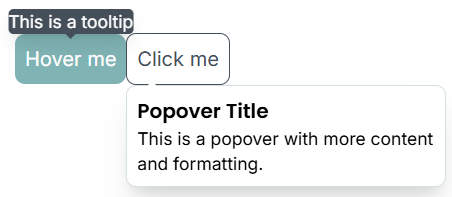

Tooltips appear as small dark boxes (River Bed background) with white text, positioned near the trigger element. They have rounded corners and a subtle shadow. Arrows point to the trigger element. Popovers are larger and can contain formatted content. They appear on hover, click, or focus depending on the trigger setting.

**Layout and Spacing Details:**
- **Tooltip Padding**: `px-3 py-2` (12px horizontal, 8px vertical)
- **Tooltip Background**: River Bed color (#454f59) with white text
- **Tooltip Position**: `absolute` with positioning relative to trigger element
- **Tooltip Arrow**: 4px border triangle pointing to trigger element
- **Tooltip Shadow**: `shadow-lg` for depth
- **Tooltip Spacing**: `mb-2` (8px) between tooltip and trigger when above, `mt-2` when below
- **Popover Padding**: `sm` (8px) spacing token for internal padding
- **Popover Width**: `w-64` (256px) for standard popovers
- **Popover Border**: 1px solid Geyser color (#d5e0e1)
- **Popover Shadow**: `shadow-xl` for stronger elevation
- **Popover Arrow**: Positioned at top with 4px border triangle
- **Section Spacing**: `space-y-8` (32px) between tooltip and popover examples
- **Trigger Button**: Uses standard button padding (`sm` / 8px)

## Dropdowns & Selects

### Purpose
Dropdowns and select components allow users to choose from a list of options in a compact space. They are used for filtering, navigation, form inputs, and presenting multiple choices without overwhelming the interface.

### Variants
*What this means: Select is the standard dropdown where users pick one option. Multi-Select lets users choose multiple options (they appear as tags/chips). Searchable selects have a search box at the top so users can type to find options in long lists. Custom Dropdowns are styled differently (like menu dropdowns). They come in three sizes. They can show different states: normal, error (red border), or disabled (grayed out).*

- **Select**: Standard dropdown select
- **Multi-Select**: Multiple option selection
- **Searchable**: Dropdown with search/filter
- **Custom Dropdown**: Custom-styled dropdown menu
- **Sizes**: `sm`, `md`, `lg`
- **States**: Default, error, disabled

### Props
*What this means: You provide an array of options - each has a value (what gets selected) and a label (what users see). You can disable specific options. The value prop holds the currently selected value (or array of values for multi-select). When selection changes, onChange runs. You can add a placeholder hint, enable multi-select mode, enable search, show an error message, or disable the whole select.*

```typescript
{
  options: Array<{
    value: string | number;
    label: string;
    disabled?: boolean;
  }>;
  value?: string | number | Array<string | number>;  // Selected value(s)
  onChange: (value: any) => void;
  placeholder?: string;
  multiple?: boolean;              // Multi-select mode
  searchable?: boolean;            // Enable search
  disabled?: boolean;
  error?: string;                  // Error message
  label?: string;
  className?: string;
}
```

### Usage Example
*What this means: The first example creates a dropdown to select a program - it shows "Select a program" as a hint, and when a user picks one, it updates selectedProgram. The second example allows selecting multiple interests - selected items appear as tags. The third example has a search box so users can type to find options in a long list.*

```jsx
import Select from '@/components/Select';

// Basic select
<Select
  label="Program"
  options={[
    { value: '1', label: 'Basketball' },
    { value: '2', label: 'Soccer' },
    { value: '3', label: 'Tennis' }
  ]}
  value={selectedProgram}
  onChange={(value) => setSelectedProgram(value)}
  placeholder="Select a program"
/>

// Multi-select
<Select
  label="Interests"
  multiple
  options={interestOptions}
  value={selectedInterests}
  onChange={setSelectedInterests}
/>

// Searchable select
<Select
  searchable
  options={largeOptionList}
  value={value}
  onChange={setValue}
  placeholder="Search and select..."
/>
```

### Visual Preview
*What this means: Select dropdowns look like input boxes with a down arrow. When you click them, a list drops down below with all options. The selected option is highlighted in teal (Gulf Stream color). The dropdown has a shadow and rounded corners. Searchable selects show a search box at the top of the dropdown. Multi-select shows selected items as small colored tags/chips above the input. Error states show a red border.*

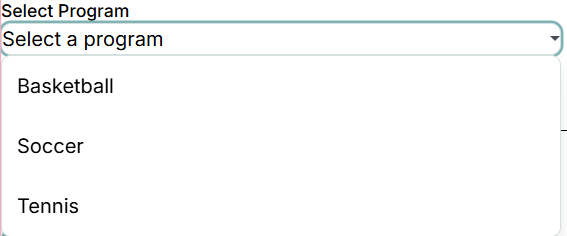
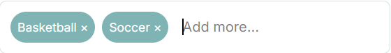

Select dropdowns have a clean appearance with River Bed border and Geyser background when open. Selected options are highlighted with Gulf Stream color. The dropdown opens below the input with a shadow. Searchable selects show a search input at the top. Multi-select shows selected items as tags/chips.

**Layout and Spacing Details:**
- **Select Input Padding**: `px-4 py-2` (16px horizontal, 8px vertical)
- **Select Border**: 1px solid Geyser color (#d5e0e1)
- **Border Radius**: `rounded-lg` (0.5rem / 8px)
- **Focus State**: 2px box shadow using Gulf Stream color (#80b3b4)
- **Dropdown Arrow**: Positioned `right-3` (12px from right), `top-1/2` centered vertically
- **Arrow Size**: 4px border triangle pointing down
- **Arrow Color**: River Bed (#454f59)
- **Label Spacing**: `mb-1` (4px) between label and select
- **Dropdown Options**: 
  - Padding: `md` (12px) spacing token on all sides
  - Hover Effect: Light teal background (#f0f5f5) on hover
  - Border Radius: `rounded-lg` for container, `rounded-b-lg` for last option
- **Multi-Select Chips**: 
  - Padding: `sm` (8px) spacing token on all sides
  - Font Size: `text-sm` (0.875rem / 14px)
  - Background: Gulf Stream color (#80b3b4) with white text
  - Border Radius: `rounded-full` (fully rounded, pill-shaped)
  - Gap: `gap-2` (8px) between chips
- **Multi-Select Container**: 
  - Padding: `md` (12px) spacing token on all sides
  - Min Height: `min-h-[40px]` with flex wrap layout
  - Border: 1px solid Geyser color (#d5e0e1)
- **Input Field Spacing**: `sm` (8px) left margin between chips and "Add more..." input field
- **Section Spacing**: `space-y-6` (24px) between select examples

## Loading States

### Purpose
Loading states provide visual feedback during asynchronous operations, data fetching, or processing. They inform users that the system is working and help manage expectations during wait times.

### Variants
*What this means: Spinners are circular animations that spin around - good for general loading. Skeletons are gray placeholder boxes that look like the content that's loading (like gray rectangles for text, gray circles for images) - they give users a preview of what's coming. Progress bars show a filled bar indicating how much is done (like 65% complete). Dots are three animated dots that bounce. Full Page loaders cover the whole screen with a spinner. Inline loaders are small and fit next to text.*

- **Spinner**: Circular loading spinner
- **Skeleton**: Placeholder content that mimics the final layout
- **Progress Bar**: Linear progress indicator
- **Dots**: Animated dots loader
- **Full Page**: Full-screen loading overlay
- **Inline**: Small inline loading indicator

### Props
*What this means: You choose which type of loader (spinner, skeleton, progress bar, or dots). You choose the size. If fullPage is true, it covers the whole screen with a dark overlay. You can add a message like "Loading events..." to tell users what's happening. For progress bars, you provide a number from 0 to 100 showing how complete it is.*

```typescript
{
  variant?: 'spinner' | 'skeleton' | 'progress' | 'dots';
  size?: 'sm' | 'md' | 'lg';
  fullPage?: boolean;              // Full-screen overlay
  message?: string;                // Loading message
  progress?: number;               // Progress percentage (0-100)
  className?: string;
}
```

### Usage Example
*What this means: The first example shows a large spinner with "Loading events..." text. The second creates three skeleton boxes (100px tall) that pulse - useful while waiting for content to load. The third shows a progress bar at 65% complete. The fourth covers the whole page with a loading overlay. The last example shows a small spinner inside a disabled button.*

```jsx
import { LoadingSpinner, SkeletonLoader } from '@/components/Loading';

// Spinner
<LoadingSpinner size="lg" message="Loading events..." />

// Skeleton loader
<SkeletonLoader
  count={3}
  height="100px"
  className="mb-4"
/>

// Progress bar
<ProgressBar progress={65} message="Uploading..." />

// Full page loader
<LoadingSpinner fullPage message="Please wait..." />

// Inline spinner
<Button disabled>
  <LoadingSpinner size="sm" /> Processing...
</Button>
```

### Visual Preview
*What this means: Spinners are circular animations in teal (Gulf Stream color) that continuously spin. Skeleton loaders are gray boxes that pulse (fade in and out) to show something is loading - they're shaped like the content that will appear. Progress bars show a horizontal bar that fills from left to right based on the percentage. Full-page loaders show a centered spinner with a semi-transparent dark overlay covering everything. All loading states are smooth animations that don't distract users.*

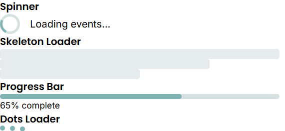

Spinners are circular animations using the Gulf Stream color (#80b3b4). Skeleton loaders show gray placeholder boxes that pulse. Progress bars display a filled bar indicating completion percentage. Full-page loaders show a centered spinner with a semi-transparent overlay. Loading states are smooth and non-intrusive.

**Layout and Spacing Details:**
- **Spinner Size**: `w-8 h-8` (32px × 32px)
- **Spinner Border**: 4px solid with Geyser color (#d5e0e1) and Gulf Stream (#80b3b4) for top border
- **Spinner Animation**: `animate-spin` for continuous rotation
- **Spinner with Text**: `gap-4` (16px) between spinner and text
- **Skeleton Loader**: 
  - Height: `h-4` (16px) for text lines
  - Width: Full width, `w-3/4` (75%), or `w-1/2` (50%) for varied lengths
  - Background: Geyser color (#d5e0e1)
  - Animation: `animate-pulse` for fade in/out effect
  - Spacing: `space-y-3` (12px) between skeleton lines
- **Progress Bar**: 
  - Container height: `h-2` (8px)
  - Background: Geyser color (#d5e0e1)
  - Fill color: Gulf Stream (#80b3b4)
  - Border radius: `rounded-full` for pill shape
- **Progress Text**: `mt-1` (4px) spacing above percentage text
- **Dots Loader**: 
  - Dot size: `w-2 h-2` (8px × 8px)
  - Gap: `gap-2` (8px) between dots
  - Animation: `animate-bounce` with staggered delays (0s, 0.1s, 0.2s)
- **Section Spacing**: `space-y-8` (32px) between different loading state examples

## Pagination

### Purpose
Pagination breaks large datasets or content into manageable pages, allowing users to navigate through results systematically. It improves performance and usability when dealing with extensive lists or search results.

### Variants
*What this means: Numbered pagination shows page numbers (1, 2, 3...) with Previous/Next buttons - best for when users need to jump to specific pages. Simple pagination only has Previous/Next buttons - good for sequential browsing. With Page Size adds a dropdown to choose how many items per page (10, 20, 50, 100). Compact pagination uses less space. Jump to Page adds an input box where users can type a page number to jump directly to it.*

- **Numbered**: Page numbers with prev/next buttons
- **Simple**: Previous/Next buttons only
- **With Page Size**: Includes items-per-page selector
- **Compact**: Minimal pagination for small spaces
- **Jump to Page**: Includes input to jump to specific page

### Props
*What this means: You provide the current page number (starting from 1) and the total number of pages. When users click a page, onPageChange runs with the new page number. You can show a page size selector (how many items per page) with options like 10, 20, 50, 100. When page size changes, onPageSizeChange runs. You can add First/Last buttons to jump to the beginning or end.*

```typescript
{
  currentPage: number;             // Current page (1-indexed)
  totalPages: number;              // Total number of pages
  onPageChange: (page: number) => void;
  showPageSize?: boolean;          // Show items per page selector
  pageSize?: number;               // Items per page
  onPageSizeChange?: (size: number) => void;
  pageSizeOptions?: number[];     // Available page sizes [10, 20, 50, 100]
  showFirstLast?: boolean;         // Show first/last page buttons
  className?: string;
}
```

### Usage Example
*What this means: The first example creates full pagination with page numbers, Previous/Next buttons, First/Last buttons, and a dropdown to choose items per page (10, 20, 50, or 100). When users change pages or page size, the state updates. The second example is simpler - just Previous/Next buttons with page numbers.*

```jsx
import Pagination from '@/components/Pagination';

<Pagination
  currentPage={currentPage}
  totalPages={totalPages}
  onPageChange={setCurrentPage}
  showPageSize
  pageSize={itemsPerPage}
  onPageSizeChange={setItemsPerPage}
  pageSizeOptions={[10, 20, 50, 100]}
  showFirstLast
/>

// Simple pagination
<Pagination
  currentPage={page}
  totalPages={pages}
  onPageChange={handlePageChange}
/>
```

### Visual Preview
*What this means: Pagination shows page numbers in the center with Previous/Next buttons on the sides. The current page is highlighted with a teal background (Gulf Stream color). Disabled buttons (like Previous on page 1) are grayed out and can't be clicked. The page size selector appears as a dropdown. On mobile phones, pagination may simplify to show only Previous/Next buttons with a page count (like "Page 2 of 10") to save space.*

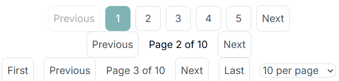

Pagination shows page numbers in the center with Previous/Next buttons on the sides. The current page is highlighted with Gulf Stream background. Disabled states (first/last page) show grayed-out buttons. Page size selector appears as a dropdown. On mobile, pagination may show only prev/next buttons with page count.

**Layout and Spacing Details:**
- **Button Padding**: `sm` (8px) spacing token for all pagination buttons
- **Button Gap**: `gap-2` (8px) between pagination buttons
- **Current Page**: Gulf Stream background (#80b3b4) with white text
- **Inactive Pages**: 1px solid border using Geyser color (#d5e0e1), River Bed text (#454f59)
- **Hover Effect**: Background changes to Geyser (#d5e0e1) on hover for inactive buttons
- **Disabled State**: `opacity-50` and `cursor-not-allowed` for disabled buttons
- **Page Number Buttons**: 
  - Fixed dimensions: 40px × 40px (square-like, rounded square appearance)
  - Padding: `sm` (8px) spacing token inside
  - Layout: Flexbox with `items-center justify-center` for centered number
  - Border Radius: `rounded-lg` for rounded corners
- **Previous/Next Buttons**: `px-3 py-2` (12px horizontal, 8px vertical)
- **Page Size Selector**: Same styling as standard select dropdown
- **Container Layout**: Flexbox with `items-center justify-center` for centered alignment
- **Text Spacing**: `gap-4` (16px) between text elements (e.g., "Page 2 of 10")
- **Section Spacing**: `space-y-6` (24px) between different pagination variants
